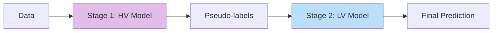

# OG-Learn

**Overfit-to-Generalization Framework for Spatiotemporal Machine Learning**

[](https://www.python.org/downloads/)
[](https://opensource.org/licenses/MIT)

---

## What is OG-Learn?

OG-Learn implements the **Overfit-to-Generalization (OG)** framework, a two-stage approach designed to improve the generalization capability of machine learning models in spatiotemporal prediction tasks.

### The Problem

Traditional machine learning models often struggle with spatiotemporal data due to:

- **Local overfitting**: Models may fit well to dense regions but fail in sparse areas
- **Spatial heterogeneity**: Different regions exhibit different patterns
- **Temporal non-stationarity**: Patterns evolve over time

### The OG Solution

The OG framework addresses these challenges through a two-stage process:



1. **Stage 1 - High-Variance (HV) Model**: Use a flexible model (e.g., LightGBM) to generate pseudo-labels with density-aware sampling and oscillation noise
2. **Stage 2 - Low-Variance (LV) Model**: Train a regularized model (e.g., MLP, ResNet) to learn from pseudo-labels, capturing generalizable patterns

---

## Quick Example

```python
from og_learn import OGModel, compare_models

# Create an OG model with preset configurations
model = OGModel(
    hv='lightgbm',      # High-variance model
    lv='mlp',           # Low-variance model  
    oscillation=0.05,   # Feature noise for regularization
    sampling_alpha=0.1  # Density-aware sampling weight
)

# Train the model
model.fit(X_train, y_train, density=density_train, epochs=100)

# Make predictions
predictions = model.predict(X_test)
```

---

## Key Features

<div class="grid cards" markdown>

-   :material-lightning-bolt:{ .lg .middle } __Easy to Use__

    ---

    Simple scikit-learn-like API with `fit()` and `predict()` methods

-   :material-cog:{ .lg .middle } __Flexible Presets__

    ---

    Built-in presets for common HV models (LightGBM, XGBoost, CatBoost) and LV models (MLP, ResNet, Transformer)

-   :material-tune:{ .lg .middle } __Fully Customizable__

    ---

    Use any model with standard `fit()`/`predict()` interface as HV or LV component

-   :material-chart-line:{ .lg .middle } __TensorBoard Integration__

    ---

    Real-time training visualization with built-in TensorBoard support

</div>

---

## Installation

```bash
pip install og-learn
```

Or install from source:

```bash
git clone https://github.com/your-username/og-learn.git
cd og-learn
pip install -e .
```

---

## Citation

If you use OG-Learn in your research, please cite:

```bibtex
@article{oglearn2025,
  title={Overfit-to-Generalization: A Framework for Spatiotemporal Machine Learning},
  author={Your Name},
  journal={Journal Name},
  year={2024}
}
```

---

## License

OG-Learn is released under the [MIT License](about/license.md).

